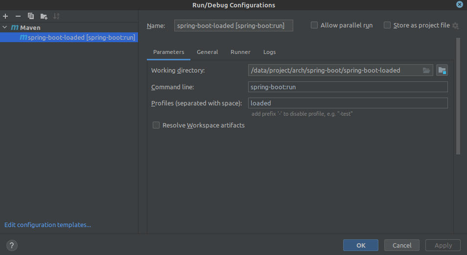

# Spring Boot Loaded

API desarrollada para evaluar el uso de Spring Loaded con Spring Boot.

https://github.com/spring-projects/spring-loaded

## Ejecución

Para iniciar la aplicación con Spring Loaded se debe activar el profile <b>loaded</b>:

    mvn spring-boot:run -P loaded

En IntelliJ IDEA:

## Reloading

Iniciada la aplicación con el profile <b>loaded</b> activado se puede editar el codigo fuente y recompilarlo:

    mvn compile

En IntelliJ IDEA:
    
    Ctrl + F9

El Java agent de Spring Loaded reemplazará las clases recompiladas sin detener la ejecución de la JVM.

## Swagger
La API puede accederse vía Swagger UI en http://localhost:8080/swagger-ui.html.

    